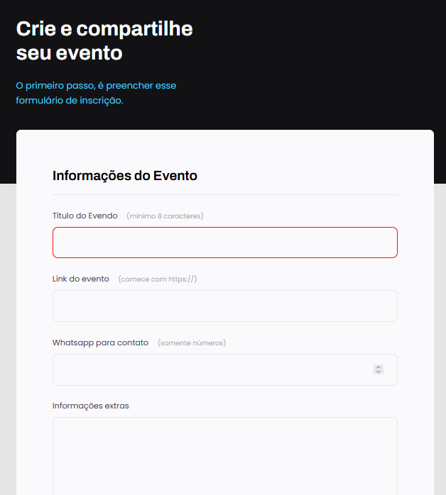

# Crie Seu Evento

Este é um projeto que demonstra como criar um formulário em HTML e estilizá-lo com alguns recursos interessantes. O objetivo é mostrar como utilizar diferentes elementos para melhorar a experiência do usuário ao interagir com o formulário.

## Assuntos Abordados

1. **Formulário no HTML:** Aprenda como criar um formulário básico utilizando as tags HTML adequadas.

2. **Agrupando campos com `fieldset` e `legend`:** Organize os campos do formulário em grupos lógicos para facilitar a compreensão e a acessibilidade.

3. **Estilização do campo `select`:** Aprenda a personalizar o elemento `select` para dar uma aparência mais agradável ao formulário.

4. **Checkbox customizado e com acessibilidade:** Estilize as caixas de seleção (`checkbox`) de forma personalizada e garanta que elas sejam acessíveis a todos os usuários.

5. **Criando estilos para o `submit`:** Adicione estilos ao botão de envio (`submit`) para tornar a interação do usuário mais atrativa.

## Instruções

1. Clone este repositório em sua máquina local:
2. Acesse a pasta crie-se-evento
3. Abra o arquivo index.html no browser de sua preferência
